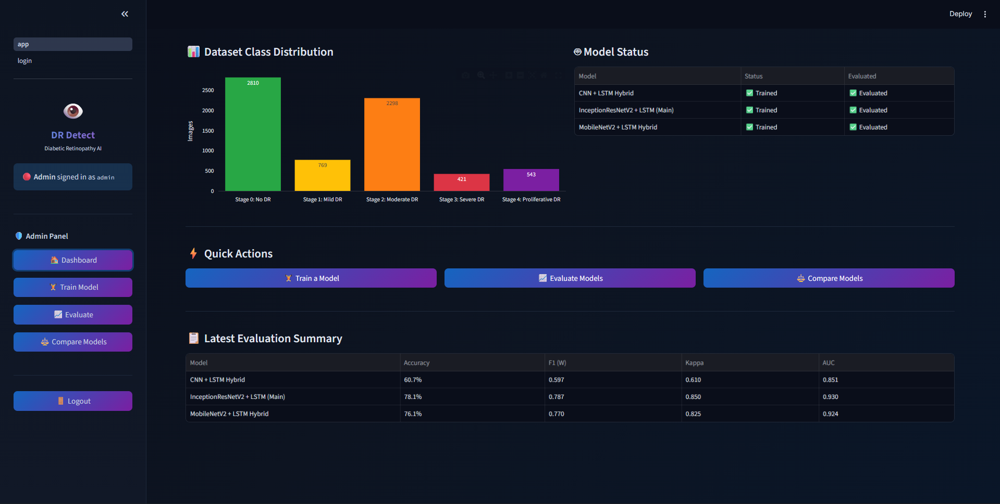
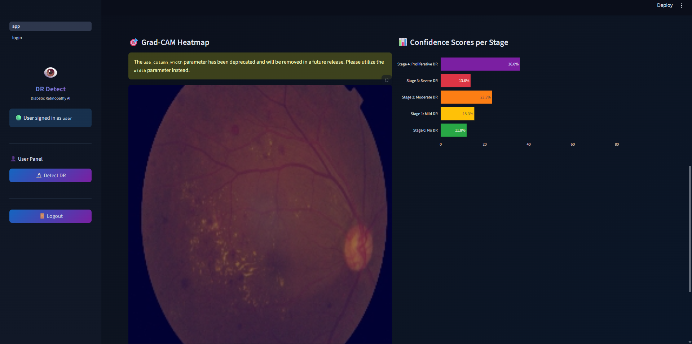
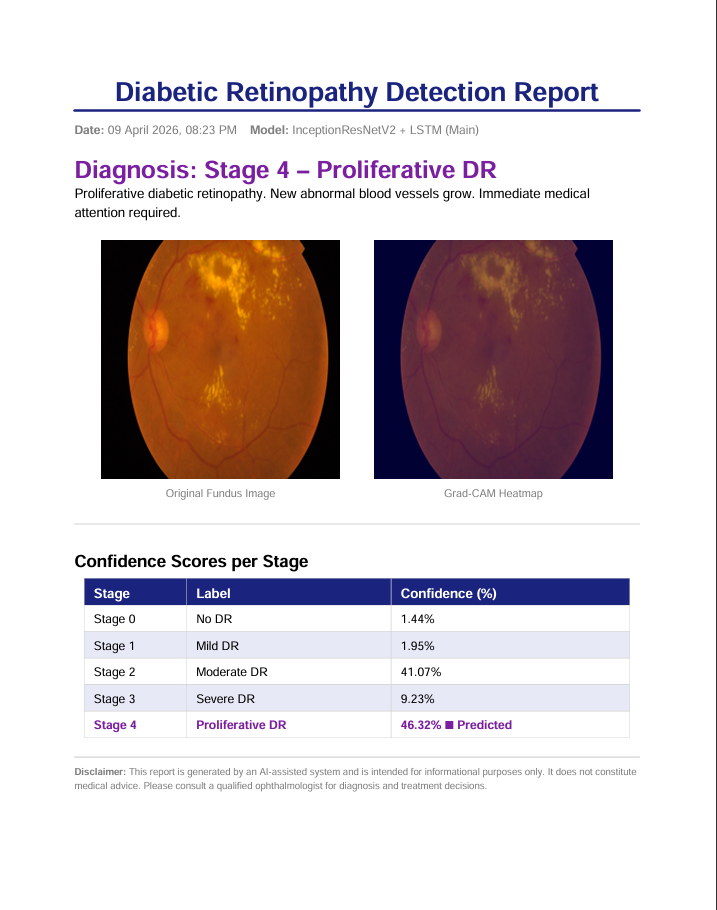
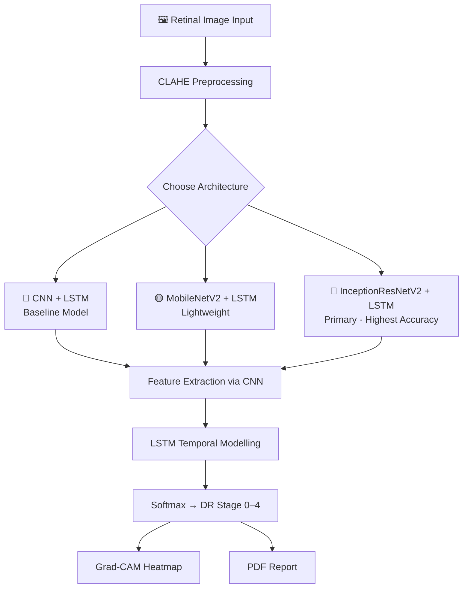

<div align="center">

<!-- ANIMATED BANNER -->


<!-- ANIMATED TYPING -->


<br/>

<!-- STATUS BADGES -->


</div>

---

## 📖 Table of Contents

| # | Section |
|---|---------|
| 1 | [🌍 Why This Matters](#-why-this-matters) |
| 2 | [🎯 What It Does](#-what-it-does) |
| 3 | [📸 Demo & Screenshots](#-demo--screenshots) |
| 4 | [🧠 Model Architectures](#-model-architectures) |
| 5 | [📊 Performance Results](#-performance-results) |
| 6 | [🔬 Grad-CAM Explainability](#-grad-cam-explainability) |
| 7 | [🛠️ Tech Stack](#%EF%B8%8F-tech-stack) |
| 8 | [⚙️ Installation](#%EF%B8%8F-installation) |
| 9 | [📂 Project Structure](#-project-structure) |
| 10 | [⚠️ Limitations & Future Work](#%EF%B8%8F-limitations--future-work) |

---

## 🌍 Why This Matters

<div align="center">

```
🇮🇳 India has 100M+ diabetics       👁️ DR is the #1 cause of preventable blindness
❌ Late diagnosis is common          🏥 Shortage of ophthalmologists in rural areas
💡 Solution: AI-powered early screening — fast, accessible, explainable
```

</div>

> **Diabetic Retinopathy (DR)** damages blood vessels in the retina.
> If caught early → **treatable**. If caught late → **permanent blindness**.
> This system brings clinical-grade AI screening to anyone with a camera.

---

## 🎯 What It Does

<div align="center">

```
📤 Upload Retinal Image
        │
        ▼
🔬 CLAHE Preprocessing (Enhance Contrast)
        │
        ▼
🧠 Deep Learning Model (InceptionResNetV2 + LSTM)
        │
        ▼
    ┌───┴──────────────────────┐
    ▼                          ▼
📊 DR Stage (0–4)         🎯 Confidence Score
    │                          │
    └──────────┬───────────────┘
               ▼
       🔥 Grad-CAM Heatmap
               │
               ▼
       📄 PDF Medical Report
```

</div>

| DR Stage | Label | Description |
|----------|-------|-------------|
| 0 | No DR | Healthy retina |
| 1 | Mild | Minor abnormalities |
| 2 | Moderate | More visible damage |
| 3 | Severe | Extensive damage |
| 4 | Proliferative DR | Critical — high blindness risk |

---

## 📸 Demo & Screenshots

<div align="center">

> 📌 **Record your Streamlit app and add GIF here**

```
<!-- Replace the line below with your actual GIF -->
```


<br/>

| User Dashboard | Grad-CAM Heatmap | PDF Report |
|:--------------:|:----------------:|:----------:|
|  |  |  |

> 💡 **Tip:** Use [ScreenToGif](https://www.screentogif.com/) or [OBS Studio](https://obsproject.com/) to record and export your demo.

</div>

---

## 🧠 Model Architectures



| Model | Role | Speed | Accuracy |
|-------|------|-------|----------|
| CNN + LSTM | Baseline | ⭐⭐⭐ Fast | ⭐⭐ Moderate |
| MobileNetV2 + LSTM | Lightweight / Mobile-ready | ⭐⭐⭐⭐ Very Fast | ⭐⭐⭐ Good |
| **InceptionResNetV2 + LSTM** | **Primary Model** | ⭐⭐ Moderate | ⭐⭐⭐⭐⭐ **Best** |

---

## 📊 Performance Results

<div align="center">

| Model | Kappa Score | F1 Score | Accuracy | AUC-ROC |
|-------|:-----------:|:--------:|:--------:|:-------:|
| 🔴 InceptionResNetV2 + LSTM | **0.85–0.92** | **0.82–0.89** | **88–94%** | ⭐ Highest |
| 🟡 MobileNetV2 + LSTM | 0.78–0.88 | 0.75–0.85 | 84–91% | ⭐ High |
| 🔵 CNN + LSTM | 0.72–0.82 | 0.70–0.80 | 80–88% | ⭐ Good |

</div>

### 📐 Metrics Explained

| Metric | Why We Use It |
|--------|--------------|
| **Quadratic Cohen's Kappa** | Penalizes severity misclassification (Stage 1 vs Stage 4 matters!) |
| **Macro F1 Score** | Balanced accuracy across all 5 unequal classes |
| **ROC-AUC** | Per-class detection quality |
| **Sensitivity / Specificity** | Clinical reliability (false negatives = missed cases = blindness) |

---

## 🔬 Grad-CAM Explainability

> **Why does this matter?** Doctors don't trust black-box AI.
> Grad-CAM shows *exactly where* the model is looking — making AI decisions auditable and trustworthy.

<div align="center">

```
Original Fundus Image          Grad-CAM Overlay
┌─────────────────────┐       ┌─────────────────────┐
│                     │       │   🔴🔴  🔴          │  🔴 = Disease Regions
│   [Retinal Image]   │  ──►  │  🔴🟡🟡🔴          │  🟡 = Borderline
│                     │       │       🔵🔵           │  🔵 = Healthy Tissue
└─────────────────────┘       └─────────────────────┘
```

</div>

**How it works:**
1. Forward pass → get prediction
2. Compute gradients of predicted class w.r.t. last conv layer
3. Weight feature maps → produce heatmap
4. Overlay on original image

**Clinical benefit:** Ophthalmologist can verify *which lesions* triggered the AI's decision — not just accept a probability score.

---

## 🛠️ Tech Stack

<div align="center">

| Layer | Technology | Purpose |
|-------|-----------|---------|
| 🧠 **Deep Learning** |   | Model training & inference |
| 🖥️ **Frontend** |  | Web UI |
| 🖼️ **Image Processing** |  | CLAHE preprocessing |
| 📊 **Visualization** |   | Charts & Grad-CAM |
| 📄 **Reports** |  | PDF generation |
| 🐍 **Language** |  | Core language |

</div>

---

## ⚙️ Installation

### Prerequisites
- Python 3.9+
- pip
- Git

### Steps

```bash
# 1. Clone the repository
git clone https://github.com/Divyesh-20/Diabetic_retinopathy.git
cd Diabetic_retinopathy

# 2. Create virtual environment
python -m venv venv

# 3. Activate it
# Windows:
venv\Scripts\activate
# macOS / Linux:
source venv/bin/activate

# 4. Install dependencies
pip install -r requirements.txt

# 5. Run the app
streamlit run app.py
```

### Default Credentials

| Role | Username | Password |
|------|----------|----------|
| 👨‍💼 Admin | `admin` | `admin123` |
| 👤 User | `user` | `user123` |

> ⚠️ **Change these credentials before any public deployment.**

---

## 📂 Project Structure

```
Diabetic_retinopathy/
│
├── 📁 dataset/
│   ├── train/
│   │   ├── No_DR/
│   │   ├── Mild/
│   │   ├── Moderate/
│   │   ├── Severe/
│   │   └── Proliferate_DR/
│   └── validation/
│
├── 📁 models/              # Saved model weights
├── 📁 assets/              # Screenshots, GIFs, images
├── 📁 reports/             # Generated PDF reports
│
├── app.py                  # Main Streamlit application
├── model.py                # Architecture definitions
├── gradcam.py              # Grad-CAM implementation
├── report_gen.py           # PDF report generator
├── requirements.txt
└── README.md
```

---

## ⚠️ Limitations & Future Work

### Current Limitations
- ❌ Not clinically validated (research use only)
- ❌ Requires ophthalmologist confirmation for diagnosis
- ❌ Performance tied to training dataset quality
- ❌ No multi-disease detection (DR only)

### 🚀 Roadmap

```
✅ Phase 1 — Core System        [DONE]
🔄 Phase 2 — Cloud Deployment   [Planned]
⏳ Phase 3 — Mobile App         [Planned]
⏳ Phase 4 — Hospital API       [Planned]
⏳ Phase 5 — Telemedicine       [Planned]
```

| Feature | Status |
|---------|--------|
| 📱 Mobile app for rural screening | ⏳ Planned |
| ☁️ REST API / Cloud deployment | ⏳ Planned |
| 🏥 Hospital EHR integration | ⏳ Planned |
| 🌐 Multi-language support (Hindi, Marathi) | ⏳ Planned |
| 🔁 Multi-disease detection | ⏳ Planned |

---

## ⚠️ Medical Disclaimer

<div align="center">

```
┌────────────────────────────────────────────────────────────────┐
│  ⚠️  DISCLAIMER                                                │
│                                                                │
│  This system is for RESEARCH & EDUCATIONAL purposes ONLY.      │
│  It does NOT replace professional medical diagnosis.           │
│  Always consult a qualified ophthalmologist.                   │
└────────────────────────────────────────────────────────────────┘
```

</div>

---

## 🤝 Contributing

```bash
# Fork the repo, then:
git checkout -b feature/your-feature-name
git commit -m "feat: describe your change"
git push origin feature/your-feature-name
# Open a Pull Request 🚀
```

---

<div align="center">

**If this project helped you, drop a ⭐ — it keeps the project alive.**


</div>
